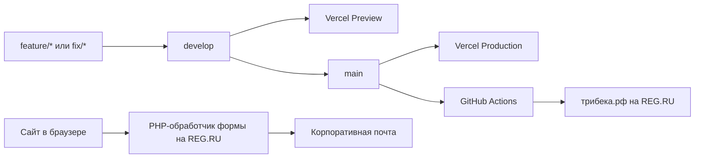

# ТРИБЕКА — корпоративный сайт

Корпоративный сайт металлообрабатывающей компании ООО «ТРИБЕКА». Проект реализован как одностраничное React-приложение (SPA) со статической production-сборкой и отдельным PHP-обработчиком формы заявки.

- Production: [https://трибека.рф](https://трибека.рф)
- Репозиторий: `sstarovoitovv/tribeka`
- Основная ветка разработки: `develop`
- Production-ветка: `main`

## Технологический стек

| Область | Технология | Назначение |
| --- | --- | --- |
| Интерфейс | React 18 | Компоненты, страницы и состояние формы |
| Маршрутизация | React Router 7 | Клиентские маршруты без перезагрузки страницы |
| Сборка | Vite 6 | Локальный сервер, оптимизация и production-сборка |
| Стили | Tailwind CSS 3 + PostCSS | Дизайн-система, адаптивная вёрстка и автопрефиксы |
| Иконки | React Icons | Интерфейсные иконки и иконки социальных сетей |
| Телефоны | libphonenumber-js | Проверка и форматирование телефонных номеров |
| Серверная форма | PHP 8 | Проверка заявки, вложения и отправка письма |
| CI/CD | GitHub Actions | Проверка, сборка, резервное копирование и деплой на REG.RU |
| Хостинг | Vercel + REG.RU | Preview/production-сборки и основной российский домен |

## Архитектура и доставка изменений



Frontend не требует постоянно работающего Node.js-сервера. Vite формирует каталог `dist`, содержимое которого раздаётся как статические файлы. Все URL приложения обрабатывает React Router, поэтому на каждом хостинге настроен возврат `index.html` для неизвестных физических путей.

Форма заявки работает отдельно от frontend: браузер отправляет `multipart/form-data` на PHP endpoint, размещённый на REG.RU. База данных для текущей архитектуры не используется.

## Структура проекта

```text
tribeka/
├── .github/
│   └── workflows/
│       └── deploy-reg-ru.yml      # Автоматический production-деплой из main
├── public/                         # Файлы, копируемые Vite в dist без преобразования
│   ├── api/
│   │   └── request.php            # Серверный обработчик формы заявки
│   ├── brand/                     # Логотипы, фирменная графика и изображения услуг
│   ├── .htaccess                  # HTTPS и SPA-маршрутизация на REG.RU/Apache
│   ├── _redirects                 # SPA fallback для совместимых static-хостингов
│   └── hero-cnc.jpg               # Главное изображение первого экрана
├── src/
│   ├── components/                # Переиспользуемые интерфейсные компоненты
│   ├── data/
│   │   └── company.js             # Преимущества и каталог услуг
│   ├── pages/                     # Компоненты отдельных маршрутов
│   ├── App.jsx                    # Таблица клиентских маршрутов
│   ├── index.css                  # Tailwind, глобальные стили и общие UI-классы
│   ├── main.jsx                   # Точка входа React-приложения
│   └── siteConfig.js              # Контакты, реквизиты, ссылки и endpoint формы
├── .env.example                   # Документация доступных переменных окружения
├── eslint.config.js               # Правила статической проверки JavaScript/JSX
├── index.html                     # HTML-шаблон, метаданные и корневой DOM-элемент
├── package.json                   # Зависимости и npm-команды
├── package-lock.json              # Зафиксированные версии npm-зависимостей
├── postcss.config.js              # Подключение Tailwind CSS и Autoprefixer
├── tailwind.config.js             # Цвета, шрифты, breakpoints и пути сканирования
├── vercel.json                    # SPA fallback для Vercel
└── vite.config.js                 # Конфигурация Vite и React-плагина
```

`dist/` и `node_modules/` не являются исходным кодом и не должны попадать в Git. `dist/` всегда создаётся заново командой `npm run build`.

## Ответственность frontend-файлов

### Страницы

| Маршрут | Компонент | Назначение |
| --- | --- | --- |
| `/` | `HomePage.jsx` | Главная страница, позиционирование, преимущества и услуги |
| `/about` | `AboutPage.jsx` | Информация о компании и производственном подходе |
| `/services` | `ServicesPage.jsx` | Каталог направлений металлообработки |
| `/services/:serviceId` | `ServiceDetailPage.jsx` | Детальная страница выбранной услуги |
| `/contacts` | `ContactsPage.jsx` | Контакты, каналы связи и форма заявки |
| `/privacy` | `PrivacyPage.jsx` | Политика обработки персональных данных |
| Любой неизвестный URL | `NotFoundPage.jsx` | Страница 404 внутри SPA |

Маршруты объявляются централизованно в `src/App.jsx`. Общий каркас страниц подключается через `Layout` и React Router `Outlet`.

### Компоненты

| Компонент | Ответственность |
| --- | --- |
| `Layout` | Общая оболочка: шапка, содержимое маршрута, мобильная навигация и подвал |
| `Header` | Десктопная навигация, контакты и мобильное меню |
| `MobileDashboard` | Нижняя навигация на мобильных устройствах |
| `Footer` | Контакты, реквизиты и вспомогательные ссылки |
| `Logo` | Единое отображение логотипа в разных частях интерфейса |
| `ContactLinks` | WhatsApp, Telegram, MAX и электронная почта |
| `PageHero` | Заголовочный блок внутренних страниц |
| `ContactBand` | Повторно используемый призыв перейти к обсуждению проекта |
| `RequestForm` | Клиентская проверка полей, управление файлами и отправка заявки |
| `MediaPlaceholder` | Временная заглушка для будущих фотографий услуг |
| `ScrollToTop` | Возврат прокрутки вверх при смене маршрута |

## Где изменять контент

| Что требуется изменить | Файл |
| --- | --- |
| Телефон, почта, адрес, реквизиты, социальные ссылки | `src/siteConfig.js` |
| Названия, описания и характеристики услуг | `src/data/company.js` |
| Преимущества компании | `src/data/company.js` |
| Состав и порядок страниц | `src/App.jsx` |
| Содержимое конкретной страницы | соответствующий файл в `src/pages/` |
| Общая шапка, подвал или навигация | соответствующий файл в `src/components/` |
| Логотипы и фотографии | `public/brand/` и `public/` |
| Глобальные цвета, типографика и UI-правила | `tailwind.config.js` и `src/index.css` |
| Поведение и ограничения формы | `src/components/RequestForm.jsx` и `public/api/request.php` |

Изображения в `public/` доступны от корня сайта. Например, файл `public/brand/logo-tribeka.png` используется в приложении как `/brand/logo-tribeka.png`.

Сейчас каталог услуг в `src/data/company.js` содержит временные данные. Объекты следует заменять реальным контентом, сохраняя уникальный `id`: он входит в URL детальной страницы услуги.

## Локальная разработка

### Требования

- Node.js 20 LTS;
- npm 10 или новее;
- Git.

CI использует Node.js 20. Для предсказуемого результата локальная среда должна использовать ту же основную версию.

### Первый запуск

```bash
git clone https://github.com/sstarovoitovv/tribeka.git
cd tribeka
git switch develop
npm ci
npm run dev
```

После запуска сайт доступен по адресу, который напечатает Vite, обычно `http://localhost:5173`.

Используйте `npm ci`, а не `npm install`, если не требуется намеренно обновить зависимости. `npm ci` устанавливает версии строго из `package-lock.json` и соответствует поведению CI.

### npm-команды

| Команда | Назначение |
| --- | --- |
| `npm run dev` | Запустить локальный Vite-сервер с hot reload |
| `npm run lint` | Проверить JavaScript и JSX правилами ESLint |
| `npm run build` | Создать оптимизированную сборку в `dist/` |
| `npm run preview` | Локально проверить уже собранный `dist/` |

Перед отправкой изменений обязательно выполнить:

```bash
npm run lint
npm run build
```

Автоматических unit/e2e-тестов в проекте пока нет. До их появления обязательный quality gate состоит из ESLint, production-сборки и ручной проверки затронутых страниц на desktop и mobile.

## Переменные окружения

Проект поддерживает одну клиентскую переменную:

| Переменная | Обязательность | Назначение |
| --- | --- | --- |
| `VITE_FORM_ENDPOINT` | Необязательная | Переопределяет URL PHP-обработчика формы |

Без переменной используется production endpoint на `трибека.рф`. Для локального переопределения:

```bash
cp .env.example .env.local
```

Затем укажите значение в `.env.local` и перезапустите Vite.

Все переменные с префиксом `VITE_` встраиваются в клиентский JavaScript и видны посетителям сайта. В них запрещено хранить пароли, API-ключи, SSH-ключи и другие секреты.

## Форма заявки

### Клиентская часть

`src/components/RequestForm.jsx`:

- проверяет обязательные поля и согласие с политикой;
- валидирует и форматирует международный телефон;
- разрешает до пяти вложений общим размером до 15 МБ;
- принимает PDF, CAD-форматы, архивы и изображения;
- отправляет данные как `multipart/form-data`;
- показывает пользователю состояния отправки и ошибки.

### Серверная часть

`public/api/request.php`:

- принимает только `POST` и CORS preflight `OPTIONS`;
- разрешает основной домен, Vercel Preview и локальный сервер;
- повторно проверяет поля, расширения, количество и размер файлов;
- использует honeypot-поле и ограничение частоты запросов;
- формирует MIME-письмо с вложениями;
- возвращает JSON и корректные HTTP-коды.

Успешный ответ endpoint:

```json
{"ok": true}
```

Обработчик использует системную отправку почты хостинга. При проблемах с доставкой сначала следует проверить папку «Спам» и журналы хостинга. Если объём заявок вырастет, обработчик следует перевести на авторизованный SMTP или транзакционный почтовый сервис, сохраняя его ключи только на сервере.

## Работа с Git-ветками

### Назначение веток

| Ветка | Назначение | Результат push |
| --- | --- | --- |
| `develop` | Интеграция и проверка следующих изменений | Новый Vercel Preview |
| `main` | Подтверждённая production-версия | Vercel Production и автоматический REG.RU deploy |
| `feature/*` | Изолированная разработка новой функции | Preview при наличии интеграции Vercel |
| `fix/*` | Исправление ошибки | Preview при наличии интеграции Vercel |

### Рекомендуемый процесс

1. Создать `feature/*` или `fix/*` от актуальной `develop`.
2. Реализовать изменение и выполнить `npm run lint` и `npm run build`.
3. Открыть pull request в `develop` и проверить Vercel Preview.
4. После приёмки объединить изменение с `develop`.
5. Для релиза открыть pull request `develop → main`.
6. После merge проверить оба production-деплоя и ключевые страницы сайта.

Не следует вести обычную разработку непосредственно в `main`. Эта ветка является триггером публикации на основной домен.

## Деплой

### Vercel

Vercel подключён к GitHub-репозиторию:

- `develop` и остальные непроизводственные ветки создают Preview deployments;
- `main` является Production Branch;
- команда сборки — `npm run build`;
- каталог результата — `dist`;
- `vercel.json` возвращает `index.html` для клиентских маршрутов.

Ручная публикация с локального компьютера не требуется. Источником деплоя должен оставаться GitHub.

### REG.RU

Workflow `.github/workflows/deploy-reg-ru.yml` запускается:

- автоматически после каждого push в `main`;
- вручную через GitHub Actions → **Deploy production to REG.RU** → **Run workflow**.

Pipeline выполняет следующие шаги:

1. Загружает commit из `main`.
2. Устанавливает Node.js 20 и зависимости через `npm ci`.
3. Запускает ESLint.
4. Создаёт production-сборку.
5. Подключается к REG.RU отдельным SSH-ключом.
6. Копирует текущую production-версию в каталог резервных копий.
7. Синхронизирует `dist/` с корнем сайта через `rsync --delete`.
8. Выполняет HTTP-проверку основного домена.

Production-каталог:

```text
/var/www/u3633961/data/www/xn--80abmkm6an.xn--p1ai
```

Резервные копии создаются в:

```text
/var/www/u3633961/data/backups/tribeka-before-<commit>-<run-id>
```

Для подключения используется GitHub Actions secret `REG_RU_SSH_KEY`. Приватный ключ запрещено добавлять в репозиторий, README или клиентские переменные. При восстановлении из резервной копии сначала нужно проверить выбранный каталог и только затем заменять production-файлы.

### SPA-маршрутизация

Открытие `/about`, `/services/...` или другого маршрута напрямую требует fallback на `index.html`:

- `vercel.json` отвечает за Vercel;
- `public/.htaccess` отвечает за REG.RU/Apache;
- `public/_redirects` сохраняет совместимость с другими static-хостингами.

Удаление этих файлов приведёт к серверным 404 при обновлении внутренних страниц.

## Безопасность

- Никогда не добавляйте в Git пароли панели, FTP/SFTP, MySQL, токены и приватные SSH-ключи.
- Локальные `.env`-файлы исключены через `.gitignore`; в `.env.example` должны находиться только названия переменных и безопасные примеры.
- Не используйте `VITE_*` для секретов: эти значения публикуются в браузере.
- Доступ production-деплоя должен выполняться отдельным ограниченным SSH-ключом.
- После раскрытия учётных данных их необходимо заменить, даже если они уже удалены из сообщения или файла.
- Для `main` рекомендуется включить branch protection: pull request, успешные проверки и запрет force push.

## Диагностика

### Локальный сервер не запускается или Vite зависает

Переустановите зависимости строго из lock-файла:

```bash
npm ci
npm run dev
```

Также проверьте версию Node.js командой `node --version`.

### Внутренний URL возвращает 404 после обновления страницы

Проверьте наличие `vercel.json` на Vercel и `.htaccess` в production-каталоге REG.RU. Сам React Router не может обработать запрос, который веб-сервер не передал в `index.html`.

### Форма показывает ошибку отправки

Проверьте:

1. доступность `/api/request.php` на основном домене;
2. допустимость Origin в CORS-настройках обработчика;
3. ограничение 15 МБ и поддерживаемое расширение вложения;
4. журналы PHP/веб-сервера и папку «Спам» почтового ящика.

### Деплой REG.RU завершился ошибкой

Откройте упавший запуск в GitHub Actions и найдите первый красный шаг. Типовые причины: удалённый SSH-ключ, изменение host key после переустановки сервера, ошибка ESLint, ошибка сборки или недоступность основного домена.

Не запускайте ручную загрузку поверх production до выяснения причины. Сначала определите, дошёл ли workflow до шага синхронизации: резервная копия создаётся непосредственно перед ним и может использоваться для контролируемого отката.
