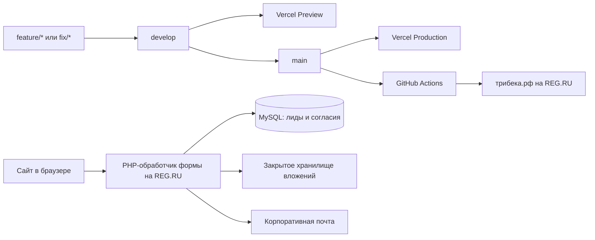

# ТРИБЕКА — корпоративный сайт

Корпоративный сайт металлообрабатывающей компании ООО «ТРИБЕКА». Проект реализован на React с полной статической генерацией HTML (SSG) и отдельным PHP-обработчиком формы заявки.

- Production: [https://трибека.рф](https://трибека.рф)
- Репозиторий: `sstarovoitovv/tribeka`
- Основная ветка разработки: `develop`
- Production-ветка: `main`

## Production-релиз от 07.09.2026

Изменения объединены в `develop` и `main` и опубликованы на трибека.рф. Однократный переход REG.RU на атомарные релизы выполнен. Проверены реальный HTTP, отрисованный Manrope, мобильная навигация и восстановление SQL-копии в отдельных тестовых таблицах. Ежедневные backup и очистка включены. Подробности и ссылки на проверки: [состояние production](docs/production-status.md). Порядок: [деплой, backup, bootstrap и rollback](docs/deployment.md). [Поисковики, sitemap и аналитика](docs/search-and-analytics.md). [Серверная защита](docs/security.md). Фактическая отправка sitemap пока не выполнена: кабинеты поисковиков ещё не настроены.

Сборка теперь содержит полное HTML-тело каждой страницы, React гидратирует готовую разметку. Неизвестные пути возвращают настоящий 404. На REG.RU исправлены правила www → apex и security headers; на Vercel используется Build Output API, PHP физически исключён из артефакта, preview получает noindex. Карта, заглушки и цвета сохранены; нижняя мобильная навигация остаётся фиксированной. Шрифт Manrope размещается на самом сайте, подписи формы и меню увеличены.

Форма проверяет поля, согласие и содержимое файлов на PHP, сохраняет несколько `attachments[]`, использует атомарный flock rate limit. Аналитика добровольная и агрегированная, DNT/GPC имеют приоритет; в статистику не попадают содержимое заявки и идентификаторы пользователей. Новая редакция политики: 2026-09-07, согласие: 2026-09-04.

Новые проверки: `npm run test:php`, `npm run test:deploy`, `npm run test:ssg` после сборки, `npm run test:e2e` (с установленным Chromium: `npx playwright install chromium`). `npm run preview:production` запускает готовый HTML на http://127.0.0.1:4173 с HTTP 404 и без исполнения PHP. Серверные тесты используют изолированные данные; реальные email и production-лиды не создаются.

Логотип имеет 267 × 71 px. Для чёткого результата нужен исходный SVG либо новый PNG около 600 × 160 px с оригинального макета; увеличение текущего PNG деталей не добавит. Размеры картинки в разметке зафиксированы, иконки кнопок уже SVG. SVG логотипа можно подставить через `src/siteConfig.js` без смены дизайна.

## Технологический стек

| Область | Технология | Назначение |
| --- | --- | --- |
| Интерфейс | React 18 | Компоненты, страницы и состояние формы |
| Маршрутизация | React Router 7 | Клиентские маршруты без перезагрузки страницы |
| Сборка | Vite 6 | Локальный сервер, оптимизация и production-сборка |
| Стили | Tailwind CSS 3 + PostCSS | Дизайн-система, адаптивная вёрстка и автопрефиксы |
| Иконки | React Icons | Интерфейсные иконки и иконки социальных сетей |
| Телефоны | libphonenumber-js | Проверка и форматирование телефонных номеров |
| SEO | Статическая генерация + runtime metadata | Уникальные метаданные, canonical, sitemap и Open Graph |
| Тестирование | Vitest + Testing Library | Автоматическая проверка формы, маршрутов и SEO-конфигурации |
| Серверная форма | PHP 8 | Проверка заявки, вложения и отправка письма |
| Реестр лидов | MySQL 8 | Контакты, статусы, согласия и метаданные заявок |
| CI/CD | GitHub Actions | Проверка, сборка, резервное копирование и деплой на REG.RU |
| Хостинг | Vercel + REG.RU | Preview/production-сборки и основной российский домен |

## Архитектура и доставка изменений



Frontend не требует постоянно работающего Node.js-сервера. Vite формирует каталог `dist`, содержимое которого раздаётся как статические файлы. После сборки SEO-генератор создаёт отдельный HTML для каждого известного маршрута. Для неизвестных URL сервер отдаёт `404.html` с кодом 404.

Форма заявки работает отдельно от frontend: браузер отправляет `multipart/form-data` на PHP endpoint, размещённый на REG.RU. Обработчик сначала сохраняет лид и доказательство согласия в MySQL, переносит вложения за пределы публичного сайта, а затем отправляет уведомление на корпоративную почту.

## Структура проекта

```text
tribeka/
├── .github/
│   └── workflows/
│       ├── deploy-reg-ru.yml      # Автоматический production-деплой из main
│       └── quality.yml            # Тесты, lint, PHP-проверка и сборка для push/PR
├── database/
│   └── migrations/
│       └── 001_create_leads.sql   # Схема таблиц лидов и вложений
├── public/                         # Файлы, копируемые Vite в dist без преобразования
│   ├── api/
│   │   └── request.php            # Серверный обработчик формы заявки
│   ├── brand/                     # Логотипы, фирменная графика и изображения услуг
│   ├── .htaccess                  # HTTPS, SSG и HTTP 404 на REG.RU/Apache
│   ├── .user.ini                  # Лимиты PHP для формы и вложений
│   ├── _redirects                 # Статическая страница 404 для static-хостингов
│   └── hero-cnc.jpg               # Главное изображение первого экрана
├── server/
│   ├── config.example.php         # Безопасный шаблон закрытого production-конфига
│   ├── prune-backups.php          # Безопасная ротация production-бэкапов
│   └── purge-expired-leads.php    # CLI-очистка лидов с истёкшим сроком хранения
├── scripts/
│   └── generate-seo-pages.mjs     # HTML маршрутов, sitemap.xml и robots.txt
├── src/
│   ├── components/                # Переиспользуемые интерфейсные компоненты
│   ├── data/
│   │   └── company.js             # Преимущества и каталог услуг
│   ├── pages/                     # Компоненты отдельных маршрутов
│   ├── App.jsx                    # Таблица клиентских маршрутов
│   ├── index.css                  # Tailwind, глобальные стили и общие UI-классы
│   ├── main.jsx                   # Точка входа React-приложения
│   ├── seoConfig.js               # Title, description, canonical и robots маршрутов
│   └── siteConfig.js              # Контакты, реквизиты, ссылки и endpoint формы
├── .env.example                   # Документация доступных переменных окружения
├── eslint.config.js               # Правила статической проверки JavaScript/JSX
├── index.html                     # HTML-шаблон, метаданные и корневой DOM-элемент
├── package.json                   # Зависимости и npm-команды
├── package-lock.json              # Зафиксированные версии npm-зависимостей
├── postcss.config.js              # Подключение Tailwind CSS и Autoprefixer
├── tailwind.config.js             # Цвета, шрифты, breakpoints и пути сканирования
├── vercel.json                    # Build Output API для Vercel
├── vitest.config.js               # Окружение автоматических frontend-тестов
└── vite.config.js                 # Конфигурация Vite и React-плагина
```

`dist/` и `node_modules/` не являются исходным кодом и не должны попадать в Git. `dist/` всегда создаётся заново командой `npm run build`.

## Ответственность frontend-файлов

### Страницы

| Маршрут | Компонент | Назначение |
| --- | --- | --- |
| `/` | `HomePage.jsx` | Главная страница, позиционирование, преимущества и услуги |
| `/about/` | `AboutPage.jsx` | Информация о компании и производственном подходе |
| `/services/` | `ServicesPage.jsx` | Каталог направлений металлообработки |
| `/services/:serviceId/ (slug)` | `ServiceDetailPage.jsx` | Детальная страница выбранной услуги |
| `/contacts/` | `ContactsPage.jsx` | Контакты, каналы связи и форма заявки |
| `/privacy/` | `PrivacyPage.jsx` | Политика обработки персональных данных |
| `/consent/` | `ConsentPage.jsx` | Отдельное согласие на обработку персональных данных |
| Любой неизвестный URL | `NotFoundPage.jsx` | Сгенерированная страница HTTP 404 |

Маршруты объявляются централизованно в `src/App.jsx`. Общий каркас страниц подключается через `Layout` и React Router `Outlet`.

### Компоненты

| Компонент | Ответственность |
| --- | --- |
| `Layout` | Общая оболочка: шапка, содержимое маршрута, мобильная навигация и подвал |
| `Header` | Десктопная навигация, контакты и мобильное меню |
| `MobileDashboard` | Нижняя навигация на мобильных устройствах |
| `Footer` | Контакты, реквизиты и вспомогательные ссылки |
| `Logo` | Единое отображение логотипа в разных частях интерфейса |
| `ContactLinks` | WhatsApp, Telegram, MAX и электронная почта |
| `PageHero` | Заголовочный блок внутренних страниц |
| `ContactBand` | Повторно используемый призыв перейти к обсуждению проекта |
| `RequestForm` | Клиентская проверка полей, управление файлами и отправка заявки |
| `SeoMetadata` | Обновление SEO-метаданных при клиентской навигации |
| `MediaPlaceholder` | Временная заглушка для будущих фотографий услуг |
| `ScrollToTop` | Возврат прокрутки вверх при смене маршрута |

## Где изменять контент

| Что требуется изменить | Файл |
| --- | --- |
| Телефон, почта, адрес, реквизиты, социальные ссылки | `src/siteConfig.js` |
| Названия, описания и характеристики услуг | `src/data/company.js` |
| Преимущества компании | `src/data/company.js` |
| Состав и порядок страниц | `src/App.jsx` |
| Содержимое конкретной страницы | соответствующий файл в `src/pages/` |
| Общая шапка, подвал или навигация | соответствующий файл в `src/components/` |
| Логотипы и фотографии | `public/brand/` и `public/` |
| Глобальные цвета, типографика и UI-правила | `tailwind.config.js` и `src/index.css` |
| Поведение и ограничения формы | `src/components/RequestForm.jsx` и `public/api/request.php` |
| SEO-заголовки, описания и режим индексации | `src/seoConfig.js` |

Изображения в `public/` доступны от корня сайта. Например, файл `public/brand/logo-tribeka.png` используется в приложении как `/brand/logo-tribeka.png`.

Сейчас каталог услуг в `src/data/company.js` содержит временные данные. Объекты следует заменять реальным контентом, сохраняя уникальный `id`: он входит в URL детальной страницы услуги.

## Локальная разработка

### Требования

- Node.js 20 LTS;
- npm 10 или новее;
- Git.

CI использует Node.js 20. Для предсказуемого результата локальная среда должна использовать ту же основную версию.

### Первый запуск

```bash
git clone https://github.com/sstarovoitovv/tribeka.git
cd tribeka
git switch develop
npm ci
npm run dev
```

После запуска сайт доступен по адресу, который напечатает Vite, обычно `http://localhost:5173`.

Используйте `npm ci`, а не `npm install`, если не требуется намеренно обновить зависимости. `npm ci` устанавливает версии строго из `package-lock.json` и соответствует поведению CI.

### npm-команды

| Команда | Назначение |
| --- | --- |
| `npm run dev` | Запустить локальный Vite-сервер с hot reload |
| `npm run lint` | Проверить JavaScript и JSX правилами ESLint |
| `npm test` | Однократно запустить автоматические тесты |
| `npm run test:watch` | Перезапускать затронутые тесты во время разработки |
| `npm run build` | Создать frontend, HTML маршрутов, sitemap и robots в `dist/` |
| `npm run preview` | Локально проверить уже собранный `dist/` |

Перед отправкой изменений обязательно выполнить:

```bash
npm run lint
npm test
npm run build
```

Тесты проверяют формирование и отправку заявки, сохранение полей при ошибке сервера, смену метаданных маршрута и уникальность SEO-параметров. GitHub Actions автоматически выполняет lint, тесты, проверку синтаксиса PHP и production-сборку для `develop`, `main` и pull request. Ручная проверка интерфейса на desktop/mobile остаётся обязательной для визуальных изменений.

## Переменные окружения

Проект поддерживает одну клиентскую переменную:

| Переменная | Обязательность | Назначение |
| --- | --- | --- |
| `VITE_FORM_ENDPOINT` | Необязательная | Переопределяет URL PHP-обработчика формы |

Без переменной используется production endpoint на `трибека.рф`. Для локального переопределения:

```bash
cp .env.example .env.local
```

Затем укажите значение в `.env.local` и перезапустите Vite.

Все переменные с префиксом `VITE_` встраиваются в клиентский JavaScript и видны посетителям сайта. В них запрещено хранить пароли, API-ключи, SSH-ключи и другие секреты.

## Форма заявки

### Клиентская часть

`src/components/RequestForm.jsx`:

- проверяет обязательные поля и согласие с политикой;
- валидирует и форматирует международный телефон;
- разрешает до пяти вложений общим размером до 15 МБ;
- принимает PDF, CAD-форматы, архивы и изображения;
- отправляет данные как `multipart/form-data`;
- показывает пользователю состояния отправки и ошибки.

### Серверная часть

`public/api/request.php`:

- принимает только `POST` и CORS preflight `OPTIONS`;
- разрешает основной домен; preview и localhost требуют точного origin в закрытом config;
- проверяет типы полей, телефон, явное согласие, MIME/сигнатуры, количество и фактический размер файлов;
- использует honeypot-поле и ограничение частоты запросов;
- сохраняет заявку и доказательство согласия в MySQL;
- переносит вложения в закрытый каталог вне web root;
- формирует MIME-письмо с вложениями;
- возвращает JSON и корректные HTTP-коды.

Успешный ответ endpoint:

```json
{"ok": true}
```

Обработчик использует системную отправку почты хостинга. Ошибка почтового уведомления не уничтожает лид: запись остаётся в MySQL со статусом уведомления `failed`. При проблемах с доставкой сначала следует проверить папку «Спам» и журналы хостинга. Если объём заявок вырастет, обработчик следует перевести на авторизованный SMTP или транзакционный почтовый сервис, сохраняя его ключи только на сервере.

### Транзакционная почта

Сейчас письмо отправляет почтовая функция REG.RU. Это не влияет на сохранность заявки: источником истины остаётся MySQL. Отдельный транзакционный сервис потребуется, если станет важна гарантированная доставка уведомлений, автоматические повторы, статистика доставок и отказов, DKIM/SPF и централизованный журнал писем.

Подключение такого сервиса требует отдельного аккаунта, подтверждённого домена, API/SMTP-ключа и проверки условий обработки персональных данных у выбранного провайдера. До выбора провайдера текущий почтовый механизм сохраняется.

## Реестр лидов и хранение вложений

Миграция `database/migrations/001_create_leads.sql` создаёт:

- `leads` — контакт, сообщение, статус, источник, технические данные, версии согласия и Политики, результат почтового уведомления и срок хранения;
- `lead_attachments` — имя, MIME-тип, размер, SHA-256 и закрытый путь каждого файла.

Файлы намеренно не записываются в BLOB и не помещаются в web root. На production они находятся в `/var/www/u3633961/data/tribeka-private/uploads/<request-id>/`, имеют случайные имена и права доступа `600`. В базе хранится только связь с заявкой и метаданные.

Закрытый файл `/var/www/u3633961/data/tribeka-private/config.php` содержит реквизиты MySQL, почтовые адреса, путь хранилища и срок хранения. Он создаётся непосредственно на сервере, не входит в Git и не перезаписывается деплоем.

Начальный срок хранения лида — 365 дней. Значение задаётся параметром `retention_days` в закрытом конфиге. Ежедневный cron запускает `server/purge-expired-leads.php`: удаляет файлы истёкших заявок, затем строки MySQL. При заключении договора срок и основание дальнейшего хранения должны определяться договорным и бухгалтерским процессом, а не формой сайта.

### Первичная настройка реестра

Для нового production-окружения:

1. Создайте отдельную базу и пользователя MySQL. Runtime-пользователю достаточно операций `SELECT`, `INSERT`, `UPDATE` и `DELETE`; изменение схемы лучше выполнять отдельно.
2. Импортируйте `database/migrations/001_create_leads.sql` через защищённый phpMyAdmin/ISPmanager или MySQL CLI.
3. Скопируйте `server/config.example.php` за пределы web root в `tribeka-private/config.php`, укажите реальные значения и установите права `600`.
4. Создайте указанный в `upload_dir` каталог с правами `700`. Он не должен находиться внутри `public/`, `dist/` или production-каталога сайта.
5. Добавьте ежедневный cron-вызов `server/purge-expired-leads.php` через PHP CLI и направьте вывод в закрытый журнал.
6. Отправьте контрольную заявку, проверьте строку в `leads`, запись в `lead_attachments`, закрытый файл, письмо и последующее тестовое удаление.

Версии юридических документов продублированы намеренно: публичные значения находятся в `src/siteConfig.js`, а принимаемые сервером — в константах `CONSENT_VERSION` и `POLICY_VERSION` файла `public/api/_lib/request-security.php`. При изменении текста обновляйте обе стороны одним коммитом. Публичный срок в `siteConfig.personalData.leadRetentionDays` также должен совпадать с фактическим `retention_days` закрытого конфига.

Рекомендуемые значения `status`:

- `new` — новая заявка;
- `contacted` — связались с заявителем;
- `qualified` — запрос подтверждён;
- `won` — заключён договор;
- `lost` — запрос не реализован;
- `closed` — работа по обращению завершена.

Просматривать и редактировать лиды следует через защищённый phpMyAdmin в ISPmanager. Публичная административная страница в проекте отсутствует намеренно.

Пример списка новых лидов:

```sql
SELECT public_id, created_at, name, phone, status, notification_status, expires_at
FROM leads
ORDER BY created_at DESC;
```

Чтобы назначить статус без изменения персональных данных:

```sql
UPDATE leads
SET status = 'contacted', contacted_at = UTC_TIMESTAMP()
WHERE public_id = '<request-id>';
```

Для досрочного удаления установите `expires_at` в прошедшее время и запустите серверный очиститель. Это удалит и строку, и связанные файлы; простое удаление строки через phpMyAdmin не очищает файл на диске.

## SEO и индексация

`src/seoConfig.js` является единым источником `title`, description, canonical, Open Graph и robots для каждого маршрута. Компонент `SeoMetadata` обновляет эти значения при навигации React без перезагрузки страницы.

После `vite build` скрипт `scripts/generate-seo-pages.mjs`:

- проверяет уникальность путей, заголовков и описаний;
- создаёт отдельный `index.html` для каждого известного маршрута;
- создаёт `sitemap.xml` только с индексируемыми страницами;
- создаёт `robots.txt` и закрывает `/api/` от обхода.

Карточки услуг пока содержат шаблонные тексты, поэтому отмечены `noindex,follow` и не добавляются в sitemap. После замены контента на реальный нужно изменить их режим индексации в `src/seoConfig.js`.

## Работа с Git-ветками

### Назначение веток

| Ветка | Назначение | Результат push |
| --- | --- | --- |
| `develop` | Интеграция и проверка следующих изменений | Новый Vercel Preview |
| `main` | Подтверждённая production-версия | Vercel Production и автоматический REG.RU deploy |
| `feature/*` | Изолированная разработка новой функции | Preview при наличии интеграции Vercel |
| `fix/*` | Исправление ошибки | Preview при наличии интеграции Vercel |

### Рекомендуемый процесс

1. Создать `feature/*` или `fix/*` от актуальной `develop`.
2. Реализовать изменение и выполнить `npm run lint`, `npm test` и `npm run build`.
3. Открыть pull request в `develop` и проверить Vercel Preview.
4. После приёмки объединить изменение с `develop`.
5. Для релиза открыть pull request `develop → main`.
6. После merge проверить оба production-деплоя и ключевые страницы сайта.

`main` защищена GitHub ruleset: изменение проходит только через pull request после успешной проверки `Automated quality checks`; force push и удаление ветки запрещены. Обязательное стороннее одобрение не включено, поскольку репозиторий сопровождает один владелец.

## Деплой

Актуальная подробная инструкция: [docs/deployment.md](docs/deployment.md). Старый `rsync --delete` по рабочему каталогу заменён на полную загрузку в отдельный release, backup базы/вложений и атомарную смену `current`, с проверкой и откатом. GitHub остаётся источником production-деплоя; main защищён PR/CI. На REG.RU однократная подготовка символьных ссылок выполнена 07.09.2026. Vercel сохраняется средой просмотра, отдельным российским production остаётся трибека.рф.

## Безопасность

- Никогда не добавляйте в Git пароли панели, FTP/SFTP, MySQL, токены и приватные SSH-ключи.
- Локальные `.env`-файлы исключены через `.gitignore`; в `.env.example` должны находиться только названия переменных и безопасные примеры.
- Не используйте `VITE_*` для секретов: эти значения публикуются в браузере.
- Доступ production-деплоя должен выполняться отдельным ограниченным SSH-ключом.
- Реквизиты MySQL должны находиться только в закрытом серверном конфиге с правами `600`.
- Вложения клиентов запрещено размещать внутри `public/`, `dist/` или другого web root.
- После раскрытия учётных данных их необходимо заменить, даже если они уже удалены из сообщения или файла.
- Защиту `main` задаёт GitHub ruleset, описанная в разделе «Работа с Git-ветками».

## Диагностика

### Локальный сервер не запускается или Vite зависает

Переустановите зависимости строго из lock-файла:

```bash
npm ci
npm run dev
```

Также проверьте версию Node.js командой `node --version`.

### Внутренний URL возвращает 404 после обновления страницы

Известный URL должен иметь сгенерированный `index.html` и запись в `prerender-manifest.json`. Проверьте сборку SSG, Apache `.htaccess` или Build Output API на Vercel. Неизвестный URL должен возвращать 404; безусловный SPA fallback восстанавливать не нужно.

### Форма показывает ошибку отправки

Проверьте:

1. доступность `/api/request.php` на основном домене;
2. допустимость Origin в CORS-настройках обработчика;
3. ограничение 15 МБ и поддерживаемое расширение вложения;
4. журналы PHP/веб-сервера и папку «Спам» почтового ящика.

### Деплой REG.RU завершился ошибкой

Откройте упавший запуск в GitHub Actions и найдите первый красный шаг. Типовые причины: удалённый SSH-ключ, изменение host key после переустановки сервера, ошибка ESLint, ошибка сборки или недоступность основного домена.

Не запускайте ручную загрузку поверх production до выяснения причины. Сначала определите, дошёл ли workflow до шага синхронизации: данные резервируются до активации нового релиза; при ошибке health check ссылка возвращается на предыдущий релиз.
